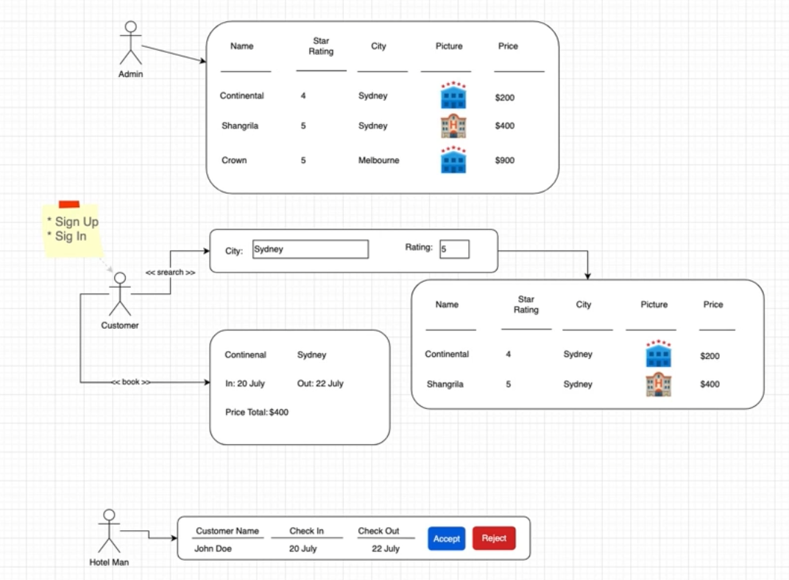
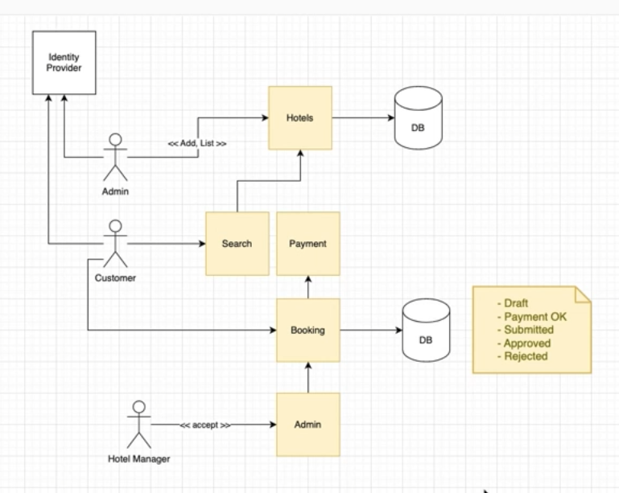

# Python Microservice on AWS

## AWS services: Incognito:
  - **API Gateway**
  - **Lambda**
  - **ECS**
  - **DynamoDB**
  - **S3**
  - **SNS**
  - **CloudMap**
  - **Secrets Manager**
  - **AWS Cognito**

## Architectural patterns for microservices: 
  - **API Gateway**
  - **Event Bus**
  - **Circuit Breaker**
  - **CQRS**

# Hotel Booking Project
## Overview

## Flowchart

# AWS Setup
## Create AWS account
- Go to aws.amazon.com/free → start sign-up
  - Sign in using root user email” (not IAM)
  - Once in, you’ll create an IAM user for day-to-day use
## Set up a local IAM profile
  - This will set up a profile on your local machine, that your projects will use through boto3
   1. Search for **IAM**
   2. In **IAM** search for **Users** -> **Create User**
   3. Untick the checkbox for 'Provide user access to the AWS console:
      1. We require a local IAM profile with access keys (for CLI + Python SDK) so we don’t need AWS console access.
   4. Choose **I want to create an IAM user**
   5. Attach a **policy** -> **AdministratorAccess**
   6. Export the **Access key** + **Secret key** as a **.csv**
      1. In the **Security credentials tab** > Scroll to the **Access keys** section > Click **Create access key**
         1. Use case → **Select Command Line Interface (CLI)**
            1. This is the correct option for AWS CLI + SDKs like boto3
## Configure a named CLI profile in Powershell or CMD for your machine, not within a virtual environment
  - `aws configure --profile course-admin`
    - After running the command, enter:
      - AWS Access Key ID: (from the .csv)
      - AWS Secret Access Key: (from the .csv)
      - Default region name: eu-west-2
      - Default output format: json
    - This writes two files for your Windows user:
      - %UserProfile%\.aws\credentials
      - %UserProfile%\.aws\config
    - Test the user credentials have been created correctly:
      - `aws sts get-caller-identity --profile course-admin`
      - If it returns your UserId, Account, and Arn, then your local IAM profile is working.
        - From there your Python project (with boto3) can use it.

Default output format: json
  - 
  - To use the profile within a Python project boto3 is used

## Verify AWS CLI on Windows
 - `aws --version`
   - You should see something like `aws-cli/2.x.x`
 - 
# Identify and Access Management: AWS Cognito

# API Gateway

# Serverless Microservices

# Containerised Microservices

# Service Discovery

# Logging for Microservices

# The Saga Pattern

# Questions

