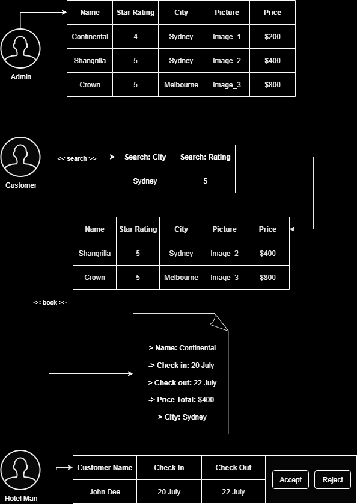
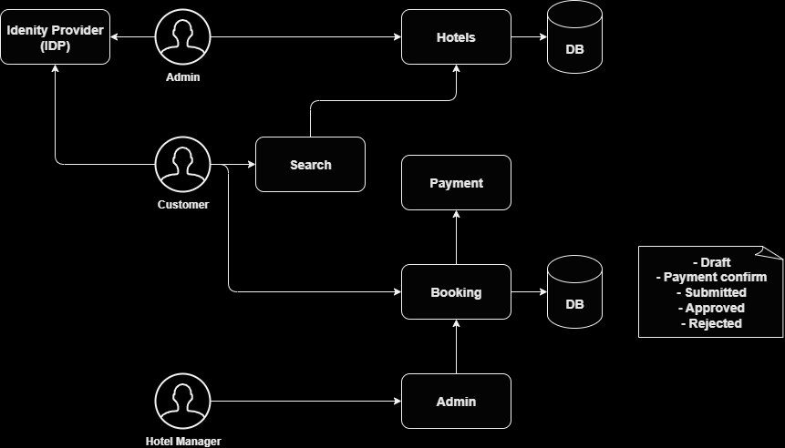
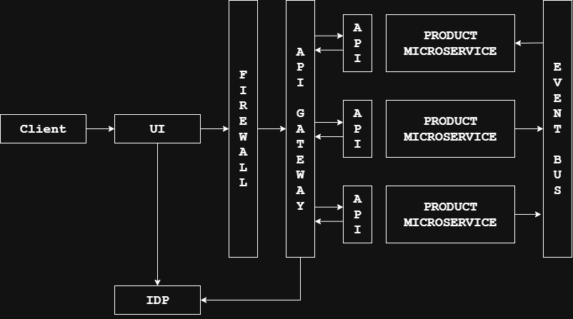

# Python Microservice on AWS

## AWS services: Incognito:
  - **API Gateway**
  - **Lambda**
  - **ECS**
  - **DynamoDB**
  - **S3**
  - **SNS**
  - **CloudMap**
  - **Secrets Manager**
  - **AWS Cognito**6

## Architectural patterns for microservices: 
  - **API Gateway**
  - **Event Bus**
  - **Circuit Breaker**
  - **CQRS**

# Hotel Booking Project
## Overview

## Flowchart


# Run the HTML code 
- Run on port 8080, not Pycharm Jetbrain's localhost: 63342
  - Start the server:
    - ```bash
      python -m http.server 8080
      ```
  - Log in through the admin page:
    - ```bash
      python -m webbrowser -t "http://localhost:8080\hotel\admin.html"
      ``` 
  - Navigate to a specific webpage:
    - ```bash
      python -m webbrowser -t "http://localhost:8080/hotel/addHotel.html"
      ```

# AWS Setup
## Create AWS account
- Go to aws.amazon.com/free → start sign-up
  - Sign in using root user email” (not IAM)
  - Once in, you’ll create an IAM user for day-to-day use
## Set up a local IAM profile
  - This will set up a profile on your local machine, that your projects will use through boto3
   1. Search for **IAM**
   2. In **IAM** search for **Users** -> **Create User**
   3. Untick the checkbox for 'Provide user access to the AWS console:
      1. We require a local IAM profile with access keys (for CLI + Python SDK) so we don’t need AWS console access.
   4. Choose **I want to create an IAM user**
   5. Attach a **policy** -> **AdministratorAccess**
   6. Export the **Access key** + **Secret key** as a **.csv**
      1. In the **Security credentials tab** > Scroll to the **Access keys** section > Click **Create access key**
         1. Use case → **Select Command Line Interface (CLI)**
            1. This is the correct option for AWS CLI + SDKs like boto3
## Configure a named CLI profile in Powershell or CMD for your machine, not within a virtual environment
  - `aws configure --profile course-admin`
    - After running the command, enter:
      - **AWS Access Key ID:** _**(from the .csv)**_
      - **AWS Secret Access Key:** _**(from the .csv)**_
      - **Default region name:** _**eu-west-2**_
      - **Default output format:** _**json**_
    - This writes two files for your Windows user:
      - %UserProfile%\.aws\credentials
      - %UserProfile%\.aws\config
    - Test the user credentials have been created correctly:
      - `aws sts get-caller-identity --profile course-admin`
      - If it returns your UserId, Account, and Arn, then your local IAM profile is working.
        - From there your Python project (with boto3) can use it.
## Verify AWS CLI on Windows
 - `aws --version`
   - You should see something like `aws-cli/2.x.x`
 
# User Identity and Access Management: AWS Cognito
## Typical microservice architecture including (Identity Provider) IDP

- **AWS Cognito:** 
  - Provides user identity and user authentication through email or federated access.
    - Federated access means the credentials are created outside of AWS Cognito.
  - Users can have attributes (E.g Name, address, phone number) and/or groups association
    - Groups can act as roles for a users, for role based authorisation.
  - Users are created manually my an admin or through a sign-up page.
  - Provides a built-in (hosted) sign-up and login page for web application, saving time.
  - Logins are based on the Open Authentication 2 protocol (OAuth 2.0).

## Setting up AWS Cognito for Hotel Booking System
- login:
  - signin.aws.amazon.com
  - Sign into console 
  - Sign in using root user
  - Search for **Cognito**
- Click hamburger menu (3 lines)
  - user pools 
  - Create **User pool**
    - Application Type: 
      - Traditional web application
    - Name your application: 
      - Python-Microservice-on-AWS
    - Configure options: 
      - E-mail
    - Required attributes for sign-up (OAuth2 Attributes): 
      - e-mail
      - given_name
      - family_name
      - address
    - Add a return URL
      - http://localhost:8080/hotel
    - Click on:
      - Create user directory
    - Click on:
      - Go to overview
- Rename
  - user pool name:
    - hotel-booking-users
- Users pools can have multiple apps:
  - Applications
    - Client Apps
    - Click on created app: python-microservies-on-aws
      - The application configuration
        - Note: client ID (aws_test_1_accessKeys.csv)
        - client secret: Not needed as we are using the AWS hosted site
        - Login Pages
          - Edit:
            - OAuth 2.0 grant types
              - Deselect: Authorization code grant
              - Select: Implicit grant (to use the AWS hosted UI)
              - OpenID connect scopes
                - OpenID: Keep to be given an ID token
                - Remove: Phone
                - Add: Profile
                  - To access user information
              - Click on Save changes
  - Domain
    - Note: Cognito domain (aws_test_1_accessKeys.csv)
    - If using our own site:
      - Actions -> Create custom domain
   User Mangement
    - Users
      - Create user
        - Email address:
          - Eg. admin@mydomain.com
            - Mark email as verified
        - Password:
          - Eg. Thefastway777!
        - Click on Create user
    - Groups
      - Create group
        - Group name:
          - Admin
            - Crate the hotels and upload the images
        - Click on Create group
      - Create group
        - Group name:
          - HotelManager
            - View the bookings and accept the bookings
        - Click on Create group
      - Select the group name
        - Admin
          - Add user to group
            - Select user
            - Add
        - Hotel Manager

## Sign in with AWS Cognito
- Use JS for connecting to Cognito to speed up development and have greater user interactions and security.
  - Insert into coginito.jw:
    - **User pool ID** into **identityPoolId**
    - Domain -> **Custom domain** into **cognitoDomain** (remove https://)
    - Application -> python-microservices-on-aws -> **ClientID** into **appId**

## Adding a Page for Creating Hotels
- addHotel.html: A page where a hotel administrator can create new hotels, into the system.
    - Name
    - Star rating
    - City
    - Picture
    - Price per night
    
# API Gateway
## API Gateway Pattern
  - Stops the consumer of a Microservice from directly accessing it.
  - Simplifies the system's interface by combining multiple APIs to one:
    - Instead of being dependent on multiple APIs it's only depandent on one API exposed by the gateway.
  - Can perform authentication and authorisation
    - Code doesn't have to be duplicated in every microservice.
  - Simplifies monitoring.
    - Code doesn't have to be duplicated in every microservice.
  - Simplifies catalogue and documentation.
    - As APIs are not scattered amongst the network and infrastructure, they are in all in the API gateway.

## Creating a Mock API and AWS API Gateway
```HTML
    <!-- replace the 'action' attribute in the form below to the API's URL -->
    <div class="container">
        <form id="upload-form" enctype="multipart/form-data"
         method="post" action="<api url here>">
```
- Search and click on -> **API Gateway**
  - Create API
  - REST API
    - Build
      - New API
      - API name: NewHotel
      - Description: Add description of API
      - Endpoint Type: Leave as Regional -> Edge optimisation to be done later.
      - Create API
- Resources: All the API definitions will be here.
- Stages: To create the actual APIs, the resources must be deployed in stages.
- Create method
  - Method type: POST
  - Integration type: Mock (when you don't have the microservice build yet, but you can test the API).
  - Create method
    - Can click on the test menu and click Test and look for a status code of 200.
  - Deploy API
    - Deployment stage: E.g **New stage** or could be **Test** or **Production**
    - Stage name: Test
    - Deploy
  - To use the API: Invoke URL value
    - Paste this URL into action within the respective HTML section (E.g. **action** value) 
  - When entering details for a new hotel with an image, we get a 500 response
    - To fix this we go to:
    - Resources
    - Post
    - Top Integration request
      - Edit
      - Mapping templates
        - In our HTML (addHotel.HTML) we have:
        - `enctype="multipart/form-data"`
        - Add into mapping templates values: **multipart/form-data**
        - Template body: `{"statusCode": 200}`
        - Save
    - Deploy API again, as not deploying will not update the changes
      - Deploy

## Authenticating API Requests
- Currently, the API is available to the public.
  - This Admin API should only been available to authorised admin users.
- Authorizers
  - Create an authorizer
  - Name: **NewHotelAuth**
  - Type: Cognito (we can use the Cognito identity pool to authenticate users).
    - We can authorise users later using a Lambda function.
  - Cognito user pool: Select from available pools -> hotel-booking-users
  - Token source: Authorization
  - Create authorizer
  - Click on new authorizer name: NewHotelAuth
    - Token value -> Enter random string
    - Click -> Test authorizer
    - Authorizer test: NewHotelAuth 401
    - We need to build an authorizer using a Lambda function:
      - Resources -> Find method -> Post
        - Click on -> First **Method request**
        - Click **Edit** -> Change to **NewHotelAuth**
        - Authorization value: Empty (Default)
        - Save -> **Deploy API** -> Stage: **Test** -> **Deploy**
        - Will return a **401** status code as HTTP header does not have an authorization token:
          - ```HTML
            <div class="container">
            <form id="upload-form" enctype="multipart/form-data" method="post" action="https://q1qlp35y7j.execute-api.eu-west-2.amazonaws.com/Test">
            ````
          - We need to add a header, in an AJAX manner:
            - In a larger project the AJAX logic should account for this.
              - In this project this function: setAuthHeader() will handle this
              - In addHotel.html if this function is called before the page is loaded it will achieve the same goal.
                - Seeing as it adds the bearer token the header.
                - ```HTML 
                  setAuthHeader();
                  $("#userId").val(currentUserToken.currentUserId);
                  $("#idToken").val(currentUserToken.idToken);
                  ```
        - Click on -> First **Method request**
        - Click **Edit** -> Change to **NewHotelAuth**
        - Within the browser -> click on **Console** -> **idToken** value
        - Default: Authorization value: **idToken**
        - Save -> **Deploy API** -> Stage: **Test** -> **Deploy**
        - Will return a **200** status code as HTTP header has an authorization token.
    
## Adding CORS (Cross-origin Resource Sharing) header to APIs
- Certain headers must be presented within the response.
  - Those headers indicate whether the domain is trustworthy.
    - This policy is there to protect our API from being invoked from a domain we don't trust
      - The header value we must include is: Access-Control-Allow-Origin
  - To do this go to **Resources**:
    - API (post)
    - Click on -> **Enable-CORS**
    - Access-Control-Allow-Origin: Is * here. but usually we don't include all using * we specify our target fields for increased security.
    - Click on -> Save
      - This will create an OPTIONS API, which is called by the browser to check if the CORS headers are presented.
      - Options -> Integrations request -> Edit
        - Mapping templates: 
          ```json
          {"statusCode": 200,
           "headers": {
                "ACCESS-CONTROL-ALLOW-Headers": "*",
                "ACCESS-CONTROL-ALLOW-Origin": "*",
                "ACCESS-CONTROL-ALLOW-Methods": "OPTIONS,POST"
                }}
          ```
          - Click on -> Save
          - Click on -> Deploy API
            - Stage: Test
            - Click on -> Deploy
- Go to: http://localhost:8080/hotel/addHotel.html
  - Using: 
    1. python -m http.server 8080
    2. python -m webbrowser -t "http://localhost:8080/hotel/addHotel.html"
  - Create a new entry and now the request will return **status code** of **200**.


# Serverless Microservices


# Containerised Microservices

# Service Discovery

# Logging for Microservices

# The Saga Pattern

# Questions

